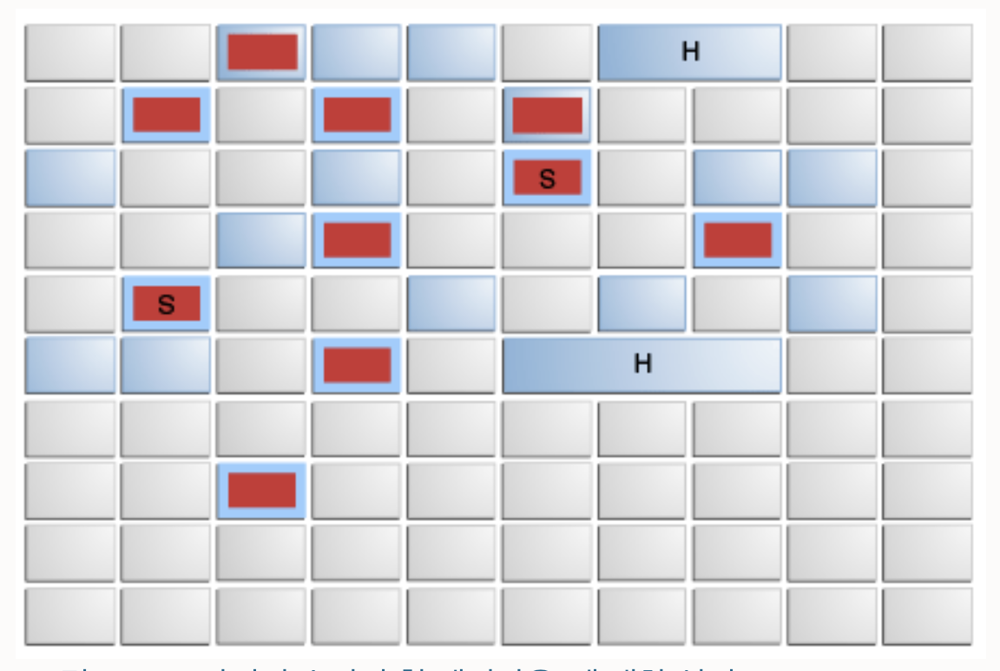

# GC란?
동적으로 할당된 메모리 영역 중 더이상 사용하지 않는 영역(unreachable object)에 대하여 메모리를 해제하는 기능

## Reachable Object 탐색
- GC Root로 부터 object를 탐색
- GC Root가 될 수 있는 조건은?
  - stack 영역의 데이터
  - method 영역의 static 데이터
  - JNI에 의해 생성된 객체

## 일반적인 GC 과정
**Mark And Sweep** : GC Root로 부터 변수를 스캔 -> 해당 변수가 참조하는 객체를 찾아 **마킹** -> 마킹되지 않은 객체는 Heap 메모리에서 제거  
**Compact** : sweep 이후 파편화되어 있는 메모리 조각을 모음

 

# G1GC
- jdk9+ 부터 기본 GC
- 기존 GC는 메모리의 연속된 공간을 나눠서 사용했다면, G1GC는 대략 2048개의 region으로 이루어짐
- 논리적으로 Young Gen, Old Gen,.. 등으로 나눔
  
출처 [https://docs.oracle.com/en/java/javase/11/gctuning/garbage-first-garbage-collector](https://docs.oracle.com/en/java/javase/11/gctuning/garbage-first-garbage-collector.html#GUID-15921907-B297-43A4-8C48-DC88035BC7CF)

- 그림에서 보여지는 "H"는 Humagous Object로 1 region 크기의 절반보다 큰 데이터로 여러 영역을 차지하고 있는 객체

## Allocation (Evacuation) Failure
- GC 수행 중, 라이브 데이터를 copy 하여 새로운 영역에 할당하려 할 때, 더이상 사용 가능한 영역을 찾을 수 없는 경우 stop-the-world(full GC)가 일어남

## Floating Garbage
- G1GC는 snapshot-at-the-beginning (SATB) 라 불리는 기술을 사용하여 GC를 수행함  
  > GC 시작 전, 객체에 대한 snapshop을 뜨고 해당 snapshot을 기반으로 객체를 탐색함
  > snapshot을 뜨는 당시, 라이브 객체였지만 실제 수행중 가비지가 되었더라도 해당 객체는 GC 대상이 되지 않음
  > 즉, G1GC는 실시간 GC가 아님
  
## Card Tables and Concurrent Phases
- Card Table 이란?
  > 바이트 배열로 이루어진 메모리 구조, old gen 에서 young gen을 참조하는 객체의 포인터 정보를 가지고 있음 (dirty card)
  > young gen의 GC 실행시, card table을 참조하여 GC 대상을 파악함 (dirty card만 검색하면 됨)
- Concurrent Phases
  > Concurrent marking
    - initial mark 에서 살아 있는 객체로 판단한 객체들의 참조를 따라가면서 마킹 (다른 스레드와 동시에 진행)
    - 이어서 새로 추가되거나 참조가 끊긴 remark 단계까지 진행 (다른 스레드와 동시에 진행)
  > Concurrent cleanup
    - unreachable object를 지우고, 비워진 영역을 사용 가능한 영역의 목록에 추가함

## Remembert set
- region 내의 참조를 관리하는 방법
- 전체 heap의 5% 미만의 공간을 remember set으로 할당함
    
## Starting a Concurrent Collection Cycle
- Concurrent Collection Cycle(concurrent marking phase)이 시작되는 시점은 JDK8 기준 -XX:InitiatingHeapOccupancyPercent=\<NN\> 해당 옵션에 의해 결정 됨  
  (default 45%)

## Pause Time Goal
- MaxGCPauseMillis 옵션을 통해 중지시간 목표를 정할 수 있음 (default 200ms)
- MaxGCPauseMillis 사용은 G1이 collection의 young gen의 수를 조정할 것임
  > young gen의 size를 줄여야 잦은 GC 를 돌아 중지 시간을 짧게 가져갈 것임
- 이때, young gen의 size를 지정하는 옵션을 사용한다면 G1이 목표 중지 시간을 달성하는데 문제가 될 수 있음
  
## Young Garbage Collections
- eden, survivor region의 라이브 데이터가 새로운 region으로 옮겨지거나 지워짐
- 데이터의 age에 따라, age 값이 높은 경우 old gen으로 promotion(승격) 됨  
  age 가 낮은 경우 survivor resion으로 옮겨지고 다음번 young/mixed garbage collection의 CSet(collection set)에 포함됨
  
## Mixed Garbage Collections
- Concurrent Collection Cycle이 끝나면, G1은 young collection에서 mixed collection으로 전환 됨
- young(eden, survivor) region 뿐만 아니라 old region도 collection이 일어남 
  (old 영역에 해당되는 region의 marking 정보가 있어서 가능)
- old region이 충분히 collect되면 G1은 다음 marking cycle이 끝날때까지 Young GC를 시도함

